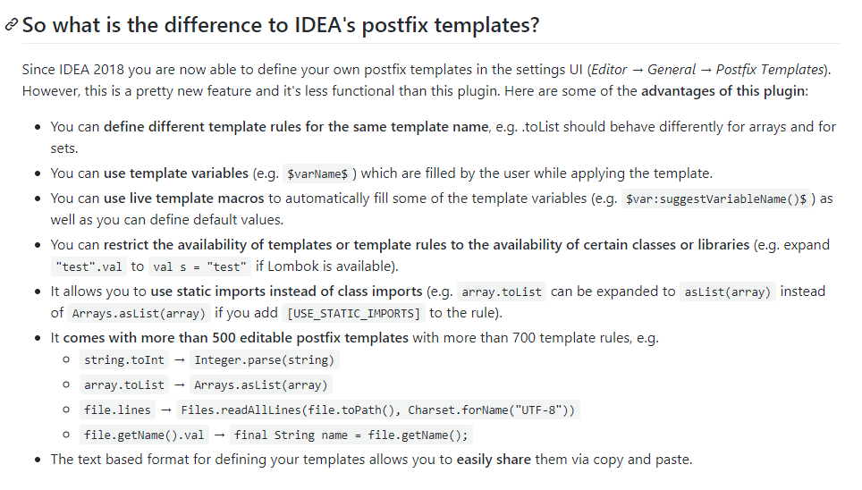

# 1. Custom Postfix Templates插件

后缀代码补全作为代码补全功能的重要补充，对提升开发效率有着不可或缺的作用。

## 1.1. Custom Postfix Templates

第三方插件[`Custom Postfix Templates`](hhttps://github.com/xylo/intellij-postfix-templates#custom-postfix-templates-for-intellij-idea)和内置的`Postfix Completion`后缀补全功能对比，前者更灵活，适用性更广，功能更强大。**推荐使用** **[下载地址](https://plugins.jetbrains.com/plugin/9862-custom-postfix-templates)**

官网的功能演示：

### 1.1.1. 和`Postfix Completion`区别

* 支持相同模板名称对应不同的代码模板
* **支持模板变量**
* **支持实时模板宏**。(可以使用内置的智能补全和提示功能)
* 将模板或模板规则的可用性限制为某些类或库的可用性
* 支持用静态导入、类导入
* 500多个可编辑的postfix模板以及700多个模板规则
* 定义模板是基于文本的格式，方便共享

