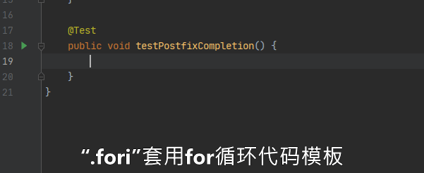
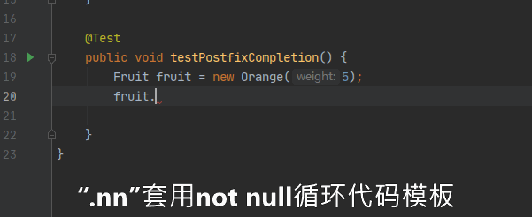
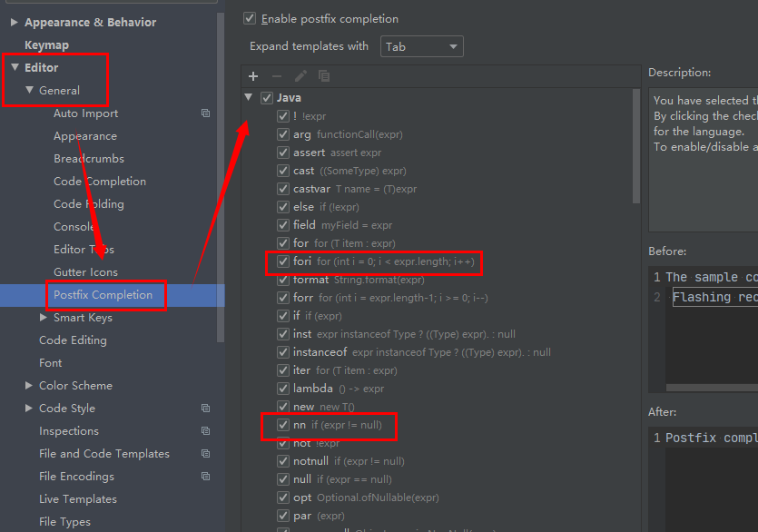
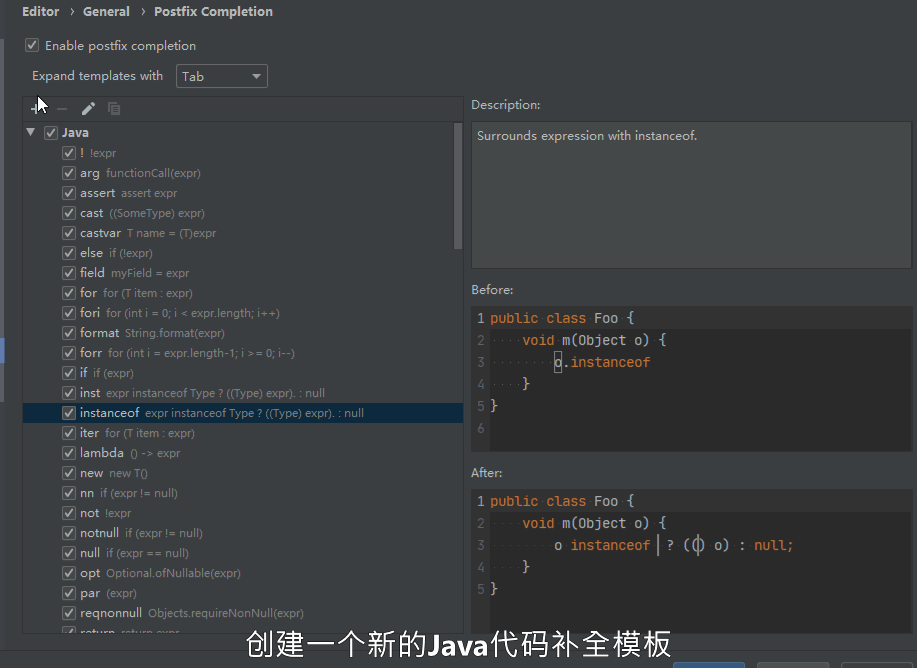

# 1. 代码提示和补全

从本章节开始主要以讲解`Intellij IDEA`的`实用技巧`为主。

代码补全和智能提示应该是现代编辑器中最重要的特性之一。让开发者免受无穷无尽的API困扰，极大的提高代码开发效率。

核心快捷键[`Ctrl`+`Shift`+`Alt`+`T`]或快捷键[`Ctrl+Alt+S`]打开设置面板。开始本章节。

---
# 2. 代码补全相关快捷键

dsfgs

---

## 2.1. 文件模板

## 2.2. `Live Templates`

## 2.3. Postfix Completion

后缀补全功能主要用于快速套用固定格式的代码模板。功能类似于`Live Templates`，区别在于后缀补全是通过在现存的某块代码块后面增加后缀的方式，快速补全，后缀前的代码块类似于一个`默认参数`。

### 2.3.1. 示例：套用`.fori`代码模板

### 2.3.2. 示例：套用`.nn`代码模板

### 2.3.3. 内置代码模板

`Intellij IDEA`默认内置`Java`、`SQL`、`TypeScript`、`JavaScript`基础的代码模板。

> `PyCharm`内置`Python`模板。`PhpStorm`内置`PHP`模板。全家桶其均内置对应语言的代码模板。

### 2.3.4. 自定义代码模板

[`File|Settings`]打开设置面板[`Editor|General|Postfix Completion`]添加后缀代码补全模板。点击
或快捷键[`Alt`+`Insert`]新增一个模板。

> :sparkles: 推荐[`Custom Postfix Templates`](1300_Custom_Postfix_Templates.md)插件。提供更多语言且更丰富的代码模板。

## 2.4. Emmet

## 2.5. 其他第三方代码模板插件

> 例如：`Custom Postfix Templates`、`Guava Postfix Completion`。详细见外功篇中对应的篇幅

推广码
46B3E-EC21E-D5D4E-379FD