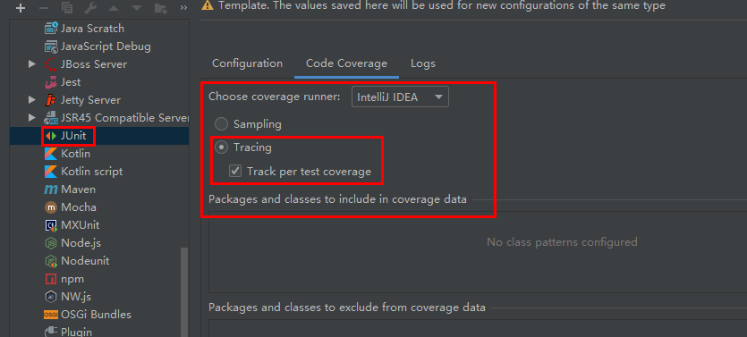
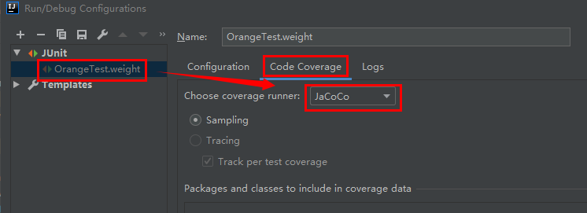
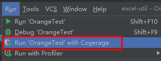
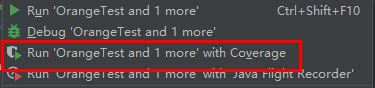
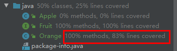
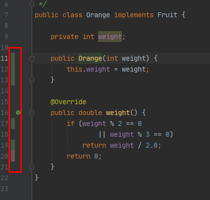
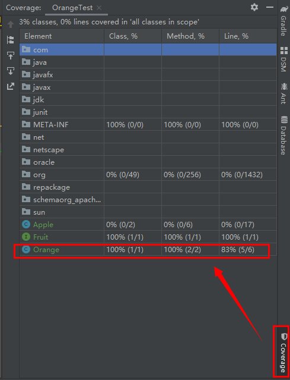
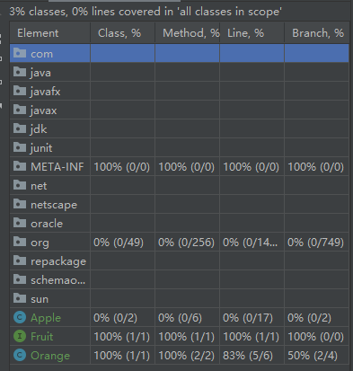
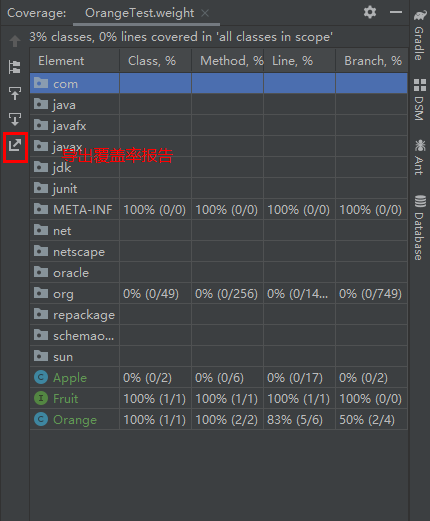

# 1. 代码覆盖率

本章节学习`Intellij IDEA`中的测试覆盖率功能。

代码覆盖率顾名思义是程序开发的源代码的被测试执行的比率。是IT企业中惯用的程序考核指标之一。

## 1.1. 代码覆盖率执行器

`Intellij IDEA`支持三种代码覆盖率执行器。

* `Code Coverage For Java`(**内置且默认**)
* `EMMA`
* `JaCoCo`

> :warning: `EMMA`已废弃，因此本文不进行任何相关的讨论。

### 1.1.1. 内置`Code Coverage For Java`插件

`Intellij IDEA`内置的覆盖率插件`Code Coverage For Java`有两种统计模式：

* Sampling：抽样模式。统计粒度为`代码行`。**执行效率高**
* Tracing：追踪模式。此时基本等同于`JaCoCo`

> 单次分析文件比较多时建议**默认配置**，满足基本需求的同时有比较高的执行效率。个人、开源等类型的项目建议**内置覆盖率执行器的Tracing模式**或`JaCoCO`

### 1.1.2. 修改JUnit测试模板的默认设置

修改`JUnit`的代码覆盖率配置，执行模式修改为`Tracing`模式为例：

菜单栏[`Run`|`Edit Confgurations`]打开配置面板。在`Temaplates`子列表下选则`JUnit`。在`Code Coverage`页签中修改。如下图所示：

> `TestNG`、`Arquillian`、`Android Test`、`Gradle`等可执行程序的配置模板均包含`Code Coverage`配置。允许开发者自定义代码覆盖率执行器相关的配置。

### 1.1.3. 临时修改覆盖率执行器为`JaCoCo`

菜单栏[`Run`|`Edit Confgurations`]打开配置面板。选择需要执行测试用例。在`Code Coverage`页签中设置覆盖率执行器为`JaCoCo`。

## 1.2. 生成测试覆盖率报告

以**默认设置**为例，讲解、展示功能。

在菜单栏中[`Run`|`Run '...' with Coverage`]、Test测试类中[`鼠标右键单击`|`Run '...' with Coverage`]生成`单个文件`的代码覆盖率报告。

在工程窗口中选择多个测试类、包路径后`鼠标右键单击`|`Run '...' with Coverage`生成`多文件`的代码覆盖率报告。

## 1.3. 查看覆盖率报告

生成的代码覆盖率报告在`Intellij IDEA`中有三类体现方式。

### 1.3.1. 文件名称后出现覆盖率概览

### 1.3.2. 源文件的左侧边栏出现覆盖状态

* 绿色：表示已覆盖
* 黄色：表示部分覆盖(**内置执行器的`Sampling`模式不生效**)
* 红色：表示未覆盖

> `鼠标左键单击`彩色部分弹出覆盖率信息弹窗。可以查看字节码、调整颜色、选择关闭显示等。

### 1.3.3. 覆盖率信息面板

内置执行器的`Sampling`模式时，覆盖率显示粒度为`代码行`。

`Tracing`模式等同于`JaCoCo`显示覆盖率粒度为`条件分支`。

## 1.4. 导出覆盖率报告(HTML格式)

导出为**HTML格式**的覆盖率报告允许用户在浏览器中重复查看。

> :sparkles: `JaCoCo`工具自身支持`XML`、`HTML`、`CSV`三种格式的覆盖率报告。但`IDEA`内置集成的`JaCoCO`仅支持导出`HTML`。

## 1.5. 设置合理的代码覆盖率指标

**开发团队应根据自身实际情况评估、平衡代码覆盖率和考核标准两者的关系**。建议指标的阀值不超过**80%**。

**单元测试用例和代码覆盖率很大程度上是相辅相成的关系**。
精心编排的测试用例，在获得高代码覆盖率的同时往往可以帮助开发者在开发阶段发现并解决代码的BUG。而测试覆盖率的提高过程反向帮助开发者逐步完善功能的单元测试，测试出更多开发时未注意的隐患。因此，某种程度上讲，高测试覆盖率可以有效的减少BUG，提高程序的健壮性。

然而，在实际的开发实践过程中，提高代码覆盖率恰如古语所言：“过犹不及，事缓则圆”。代码的覆盖率一旦**超过75%**（**按功能模块划分，非单文件**），受限于测试用例、测试环境的局限性，覆盖率的提升的性价比急剧下降。此时继续一味的追求代码覆盖率的高数值，并没有什么特别大的实际意义，反而是对开发者工时的一种浪费。
