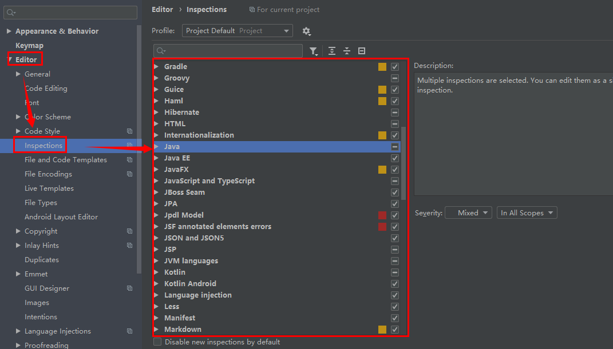
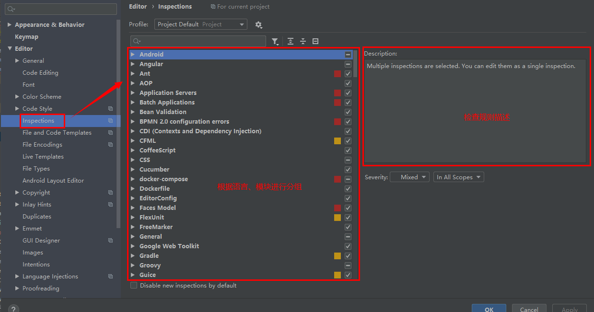
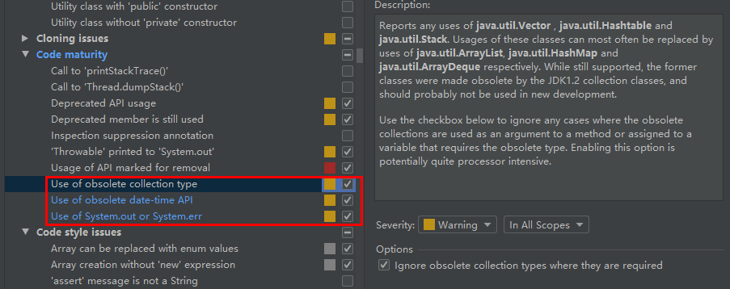
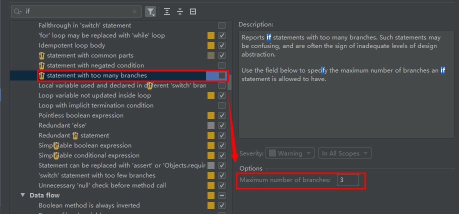
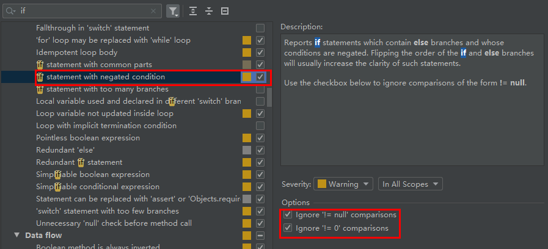
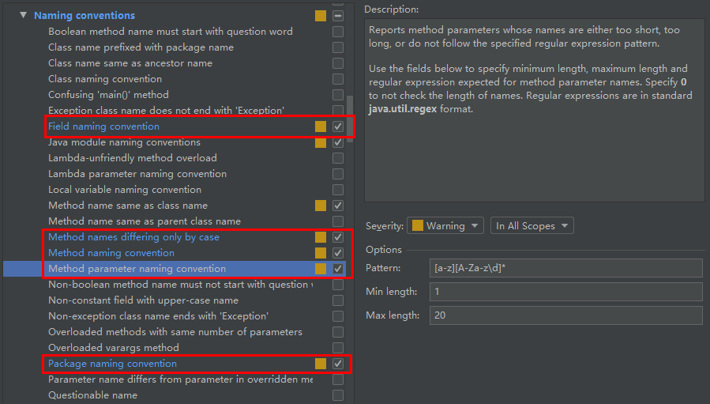

# 1. 静态代码分析和检查

静态代码分析功能是现代化编辑器中重要的功能之一。帮助开发者避免特定范式的不规范、错误、不安全的逻辑，一定程度上增加程序的健壮性。

`Intellij IDEA`内置非常完善且通用的基于源文件的静态代码分析、检查功能。**默认启用通用、基础的检查规则，相当一部分规则未启用**，用户可以根据自身需求启、停。同时，得益于`Idea`的良好的扩展性，很多常见的第三方分析插件均提供官方团队的支持（`SpotBugs`、`SonarLint`、`DeepCode`等）。

开发团队根据实际情况和自身的需求适当的扩展、启用、停用、选择规则。

> 目前笔者使用的插件 **`SonarQube`**、**[阿里巴巴Java代码规范](/zh-cn/1000_阿里巴巴Java代码规范)**。

> :warning: 目前市面常用的插件虽然提供了更多，更详细的范式不安全警告。但或多或少都有`误报`的情况。需要开发者人为去排查和分析。

## 1.1. 设置面板

[<u>F</u>ile | Setting] 或 [`Ctrl`+`Alt`+`S`]打开设置界面。继续打开`Editor`|`Inspections`。在右侧的列表中根据模块选择、查看、启、停规则。

## 1.2. `Java`相关的检查规则

修改`Intellij IDEA`的缺省检查规则，以更好的帮助开发者开发健壮的代码。`愿我佛慈悲，远离BUG`。

### 1.2.1. 魔法值

在团队开发中，魔法值一直是都是极大的隐患。`魔法数字`和`魔法字符串`默认关闭，建议开启。

## 1.3. Code Maturity

避免使用废弃、淘汰的集合（`Vector`、`HashTable`）、日期(`Date`、`Calender`)相关API。使用日志库替代`System.out`等。

## 1.4. 逻辑流程控制

### 1.4.1. `if`分支过多

缺省值为 **`3`**。当`if`的条件语句超过`3`个时，建议提取为方法。

### 1.4.2. `if`的取反条件

在开发中尽可能避免取反条件。正向逻辑更利于理解。

## 1.5. 命名规范

`Java`对命名并没有非常严格的强制的规范。但约定俗成的惯例是根据`驼峰命名法`命名。在`Intellij IDEA`中可以启用对应的检查规则以规范命名方式。

在`Java|Nameing conventions`中如下图所示启用字段、方法、方法参数、包名的命名规范检查规则。

## 1.6. 序列化

### 1.6.1. 实现`Serializable`接口的类没有定义`serialVersionUID`

