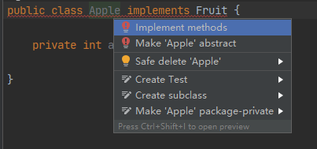
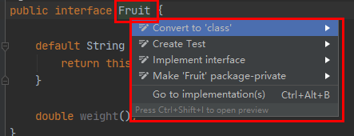
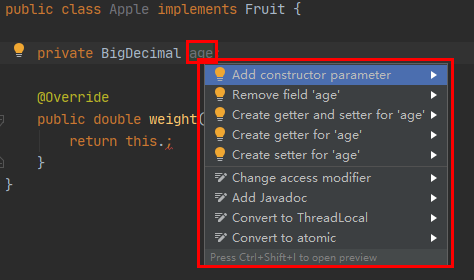
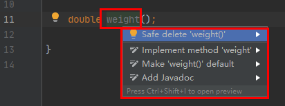
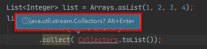
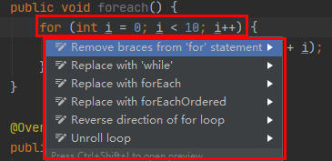
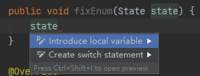

# 1. [`Alt`+`Enter`]实战

组合快捷键`Alt`+`Enter`是`Intellij IDEA`中最重要、功能最复杂的快捷键，没有之一。
主要功能是**根据光标所在位置的`内容`显示可能的上下文行为(提示代码的修复、修改、生成等方案)**。
下面开始学习本章节，笔者将以案例分析的方式，引导读者掌握此功能。

> 此功能非常依赖编程语言的固定范式、语法约束等语言内部的`规则`。通过这些`规则`、`约定`。`Intellij IDEA`可以把开发者的常用的可能行为，通过在弹窗中列举出来，从而帮助开发者快速编码，简化编码流程、减少操作步骤，最终归达到提高开发效率的目的。

> :warning: 对于弱类型的编程语言，此功能会显的格外的弱，无用。例如：Python(`PyCharm`是通过一套约定格式的注解来提示、索引。对使用Python 3.5以上版本的脚本，支持`typing`检查)

> :warning: 以下`案例`均是在笔者的常用开发环境基础上的截图。可能和读者的结果细节略微不同。**理解功能为主，勿生搬硬套**。

## 1.1. 对类、接口使用

### 1.1.1. 案例：当前类未实现接口中定义的某些方法时

`Apple`类继承于`Fruit`，且未实现接口中方法。光标在`Apple`类名称时，弹窗菜单如下图所示：

* `Implement methods`：实现接口、抽象类中的方法。类似于快捷键[`Ctrl`+`O`]，但是相比较而言，追溯的范围小，不包含`Object`中的方法。
* `Make 'Apple' abstract`：`Apple`类新增`abstract`修饰符。
* `Safe delete 'Apple'：`删除`Apple`类。
* `Create Test`：创建Test单元测试。
* `Create subclass`：创建一个子类继承当前类。
* `Make 'Apple' package-private`：修改`Apple`类的修饰符为`package-provate`（移除`public`修饰符）。

### 1.1.2. 案例：当接口、抽象类的子类中存在未实现父方法时

光标在`Fruit`接口定义处时。如下图所示：

* `Convert to 'class'`：将接口转换为类。
* `Create Test`：创建Test单元测试。
* `Implement interface`：**实现接口**。
* `Make 'Fruit' package-private`：修改`Fruit`的访问修饰符为`package-provate`（移除`public`修饰符）。
* `Go to implementation(s)`：跳转到接口的实现。

## 1.2. 对类、接口成员使用

### 1.2.1. 案例：类字段未定义`getter`或`setter`

菜单功能如下：
* `Add constructor parameter`：增加为构造函数参数。多构造函数时，弹窗选择需要修改的构造函数。
* `Remove field 'age'`：移除`age`字段。
* `Create getter and setter for 'age'`：生成getter和setter方法。
* `Create getter for 'age'`：生成getter方法。
* `Create setter for 'age'`：生成setter方法。
* `Change access modifier`：修改访问修饰符。
* `Add Javadoc`：增加doc。
* `Convert to ThreadLocal`：转换为`ThreadLocal`字段。
* `Convert to atomic`：转换为Atomic字段。

> :sparkles: 使用[`Alt`+`Insert`]组合快捷键批量生成`getter`和`setter`。而后新增字段可以通过[`Alt`+`Enter`]增量追加。

### 1.2.2. 案例：实现接口的子类中还存在未实现的接口方法

菜单功能如下：
* `Safe delete 'weight()'`：安全删除此方法。
* `Implement method 'weight'`：**在子类中实现方法**。
* `Make 'weight()' default`：新增`default`修饰符。
* `Add Javadoc`：增加doc。

> :sparkles: 一般用于快速在子类中增加接口中定义的未实现的方法。

## 1.3. 对错误、警告使用

### 1.3.1. 案例：当`Collectors`类未导入时

* `Import class`：导入类。
* `Create class 'Collectors'`：创建`Collectors`类。
* `Create field 'Collectors' in 'Apple'`：在`Apple`类中创建`Collectors`字段。
* `Create inner class 'Collectors'`：创建内部`Collectors`类。
* `Create local variable 'Collectors'`：创建本地变量`Collectors`。
* `Rename reference`：重命名引用。
* `Introduce local variable`：引入本地变量。

当出现自动弹出的弹窗时，快捷键作用默认为`Import class`

## 1.4. 对代码块使用

### 1.4.1. 案例：提取代码块的逻辑为独立的方法

<!-- TODO: -->
> 详细见 [`代码重构`]()

### 1.4.2. 案例：for、foreach、while等迭代方式切换

对特殊的代码结构，`Intellij IDEA`集成一些常用的代码模板。

* `Remove braces from for statement`：删除花括号。
* `Replace with 'while'`：替换成while循环。
* `Replace with forEach`：替换成forEach循环。
* `Replace with forEachOrdered`：替换成有序的forEach循环。
* `Reverse direction of for loop`：逆序循环。
* `Unroll loop`：展开循环。

### 1.4.3. 案例：根据`Enum`生成switch各条件分支

* `Introduce local variable`：引入本地变量。
* `Create switch statement`：**根据`Enum`生成switch代码模板**。