# 1. 代码重构

---
## 1.1. 菜单和弹窗面板

**核心快捷键[`Ctrl`+`Shift`+`Alt`+`T` ]再光标位置打开重构菜单弹窗。**

重构菜单和重构弹窗如下图所示：

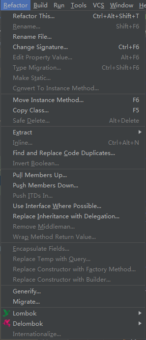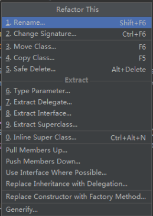

---

## 1.2. 修改签名

[`Refactor`|`Changne Signature...`]或快捷键[`Ctrl`+`F6`]弹出类签名修改弹窗。

### 1.2.1. 修改接口、类签名

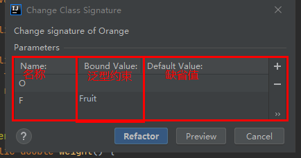

### 1.2.2. 修改方法签名

针对方法可见性、返回类型、方法名称、方法参数、抛出异常、方法调用方式（修改原方法和委托重载方法两种方式）进行重构。

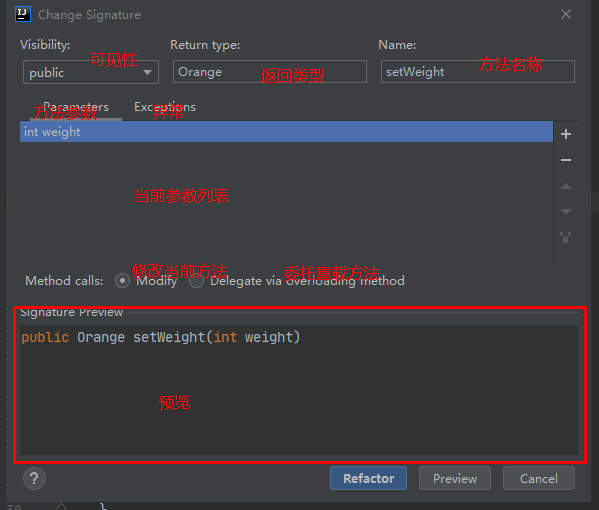

---

## 1.3. 封装字段

相比于`Setter`和`Getter`模板。提供更丰富的封装相关的参数和设置。

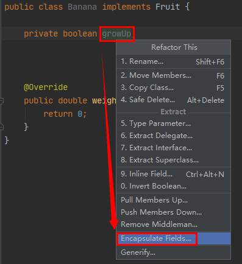

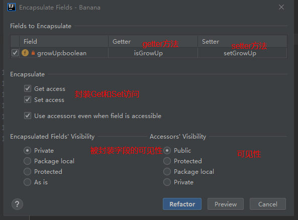

---

## 1.4. 提取

### 1.4.1. 提取常量

### 1.4.2. 提取字段

### 1.4.3. **提取接口**

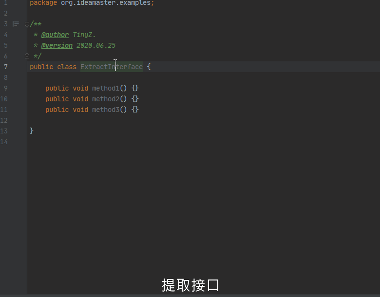

### 1.4.4. **提取方法**

快捷键[`Ctrl`+`Alt`+`M`]弹出提取方法弹窗。

> 等同于选中代码块后使用快捷键[`Alt`+`Enter`]，快速提取代码块为方法。

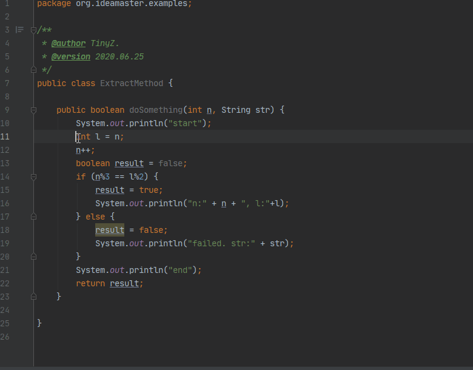

### 1.4.5. **提取为方法参数**

快捷键[`Ctrl`+`Alt`+`P`]弹出提取方法参数弹窗。

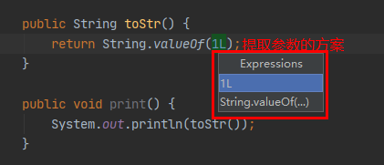

## 1.5. 向下推、向上拉成员

### 1.5.1. **向上拉成员**

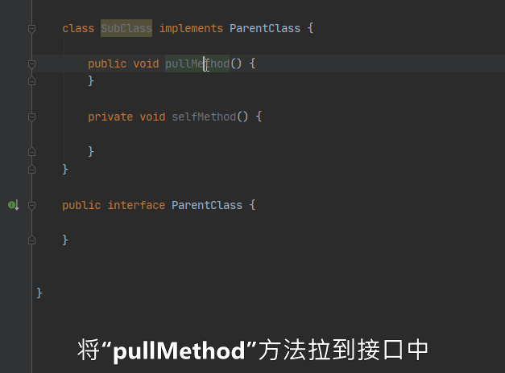

### 1.5.2. 向下推成员

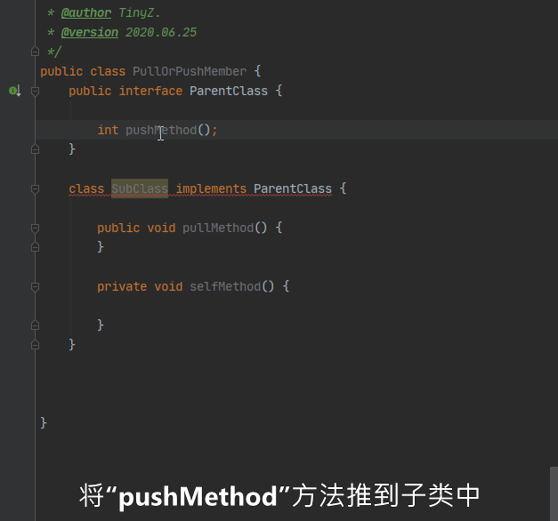

> 向下推成员和[`Alt`+`Enter`]在子类在实现接口、抽象类方法功能类似。

---
## 1.6. 反转返回值为布尔值的方法

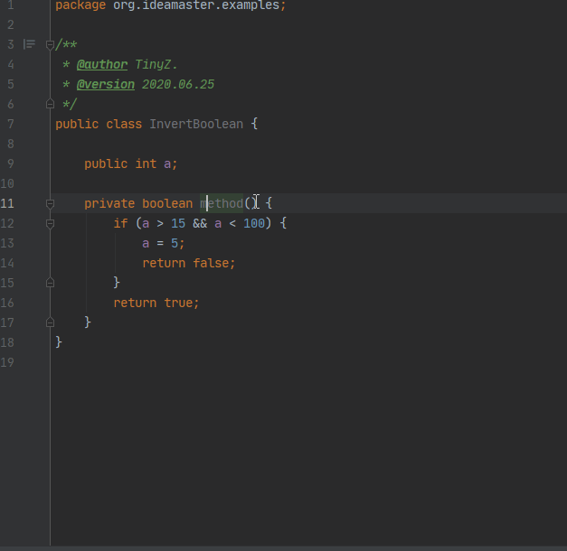

---
## 1.7. **重命名**

快捷键[`Shift`+`F6`]。 重命名变量、类名称、方法名称等。

## **重构字段的类型**

快捷键[`Ctrl`+`Shift`+`F6`]。`Type migration`重构字段的类型。

---
## 1.8. **构造函数转换为`Builder`**

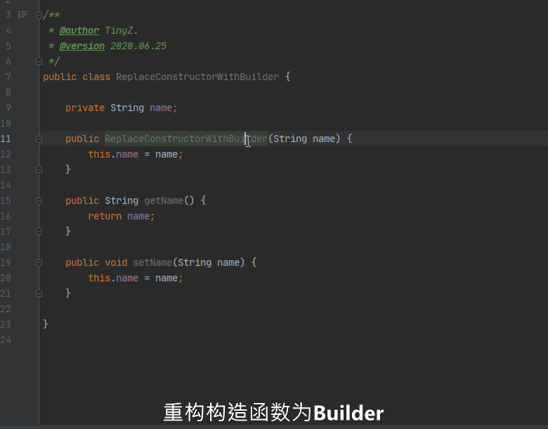

> 快速根据现存的构造函数生成对应的`Builder`类。

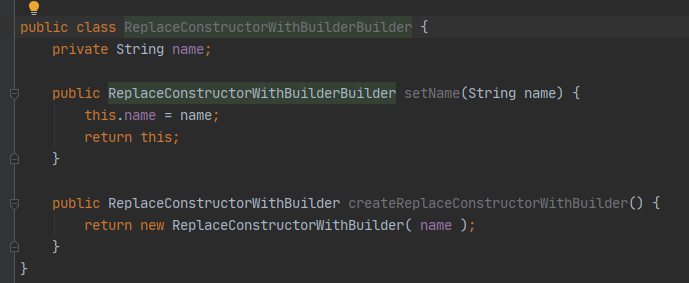

---
## 1.9. 构造函数转换为工厂方法`Factory`

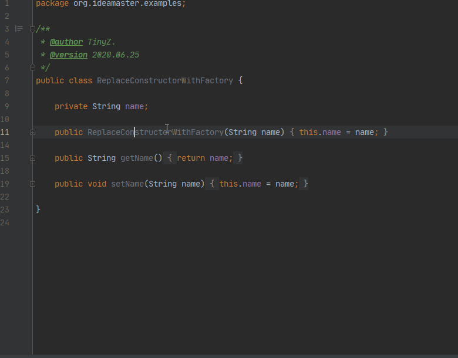

