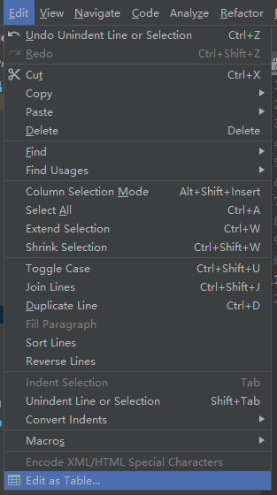

# 导航栏

介绍日常开发中常用的快捷键，善于使用快捷键能极大的提高开发效率。

---
## 定位导航栏快捷键

定位到导航栏的快捷键为[`Alt` + 菜单名称中下划线对应的字母]。

示例：
* \`<u>F</u>ile\` => [`Alt` + `F`]
* \`VC<u>S</u>\` => [`Alt` + `S`]

导航栏定位之后，使用键盘`<-`和`->`向左或向右切换到邻近的导航栏菜单。

---
## \`<u>F</u>ile\`

* **`Setting...`**: 当前项目的设置。[`Ctrl` + `Alt` + `S`]
* **`Project Structure...`**: 当前项目的工程结构设置。[`Ctrl` + `Alt` + `Shift` + `S`]
* `Reload All from Disk`: 从磁盘重新加载工程。
* **`Invalidate Caches / Restart`** [1](#refer-anchar-1): 清理缓存并重启。
* `Manage IDE Settings` [2](#refer-anchar-1)：管理编辑器相关配置。
* **`New Projects Settings`**：新项目的缺省配置
* `Export`：导出位Eclipse，Zip等
* `Power Save Mode`：省电模式。**开启之后例如代码提示等功能将失效**

[1] IDEA内部维持一份虚拟文件系统。某些情况下，虚拟文件系统会出现异常，导致某些文件引用缺失或错误时，可以通过此功能清理虚拟文件系统的数据。

[2] 默认IDE的配置保存在本地磁盘`C:\Users\用户名\.IntelliJIdea`路径下。可以通过启用`Sync Settings To JetBrains Account...`将IDE的配置文件同步到远端，由JetBrains管理。

---
## \`<u>E</u>dit\`

### `Column Selection Mode`

[`Alt`+`Shift`+`Insert`]：列选中模式。鼠标左键选中变更为多行选中

<iframe src="../../images/100_3.gif"></iframe>

### `Extend Selection`

[`Ctrl`+`W`]：扩展选中范围

### `Shrink Selection`
[`Ctrl`+`Shift`+`W`]：缩小选中范围
### `Toggle Case`
[`Ctrl`+`Shift`+`U`]：大小写字母转换。
### `Join Lines`
[`Ctrl`+`Shift`+`J`]：合并行。将下一行内容追加合并到当前行尾
### `Duplicate Line`
[`Ctrl`+`D`]：复制行。

